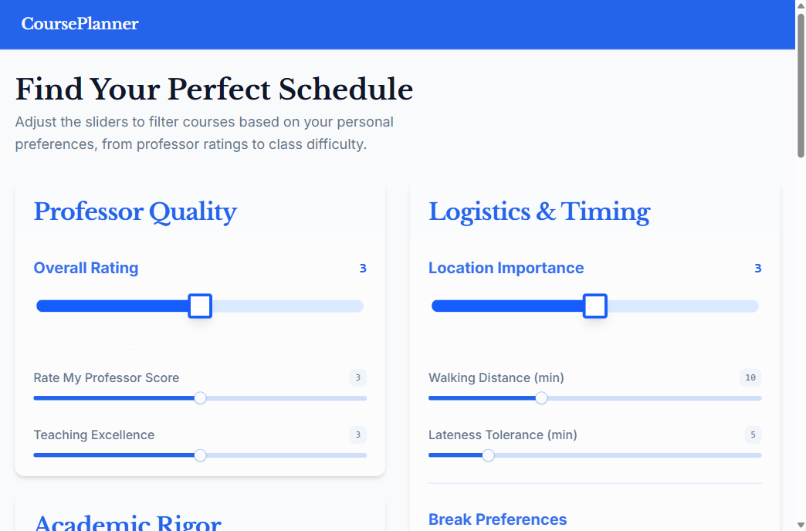
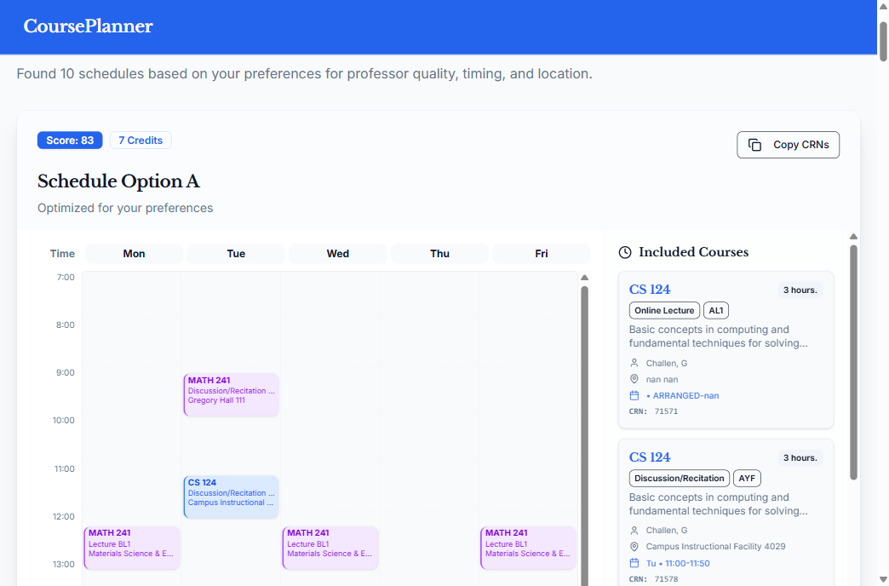

# Schedule Generator

A course scheduler for UIUC. You tell it which classes you want, when you need to be free, and what
you actually care about (good professors? easy A? not sprinting across campus between classes?), and
it hands you the 10 best conflict-free schedules.

It runs on a snapshot of Spring 2025 course data, which also includes each section's grade history,
RateMyProfessor score, and ICES teaching ratings, so the ranking is based on real numbers instead of
guesswork.

| Set your preferences | Get ranked schedules |
| --- | --- |
|  |  |

## How you use it

1. Search for classes by department (`CS`, `MATH`, `ECE`, whatever).
2. Paint your week on a grid to mark times you'd rather keep free, or absolutely must keep free.
3. Drag some sliders to say how much professor quality / difficulty / walking distance matter to you.
4. Hit generate. It figures out every combination of sections that actually fits, scores them, and
   shows you the top 10.

## How it's put together

There are two moving parts:

- **Backend** (`data_processing/filter/`) — a Flask app that does the actual scheduling. This is
  where the real logic lives.
- **Frontend** (`frontend/PageStyler/`) — a React + Vite app for the UI. It talks to the Flask
  backend directly over HTTP.

```
React/Vite UI  ──HTTP──►  Flask backend  ──reads──►  Spring 2025 course CSV
 (port 5000)              (port 5001)                (grades + RMP + ICES)
```

> Heads up: there's also an Express server inside the frontend folder. That's leftover Replit
> scaffolding for serving the built site — it's not the scheduling API. The Flask app is the backend.

### Where things are

```
data_processing/filter/
  app.py                  # the HTTP endpoints
  scheduler.py            # ties it all together, returns the top 10
  hard_filtering_code.py  # finds every schedule with no time conflicts
  soft_filtering_code.py  # scores professors, grades, break times
  location_code.py        # scores walking distance between classes
  buildings_coords.json   # UIUC building -> lat/lon (from OpenStreetMap)

datasets/
  11-7-2025-sp.csv        # the Spring 2025 course data (~7 MB)

frontend/PageStyler/      # React 19 + Vite + Tailwind + shadcn/ui
BACKEND_API_DOCUMENTATION.md
```

## What the scheduler is actually doing

**Step 1 — find schedules that fit.** The week is a 5×90 grid: five weekdays by ninety 10-minute
slots (7 AM to 10 PM). Each section gets stamped onto that grid, and a depth-first search tries every
combination of sections, throwing out any that overlap or that hit a time you blocked off. Lectures
and their discussions/labs get kept together. It stops at 30,000 candidates so it doesn't run
forever.

**Step 2 — score what's left.** Every valid schedule gets a 0–100 score built from four things, each
weighted by how much you said you care:

- **Professors** — RateMyProfessor score plus ICES "Excellent"/"Outstanding" ratings.
- **Difficulty** — historical average GPA (both per-professor and per-class), and the share of
  students who got your target grade or better.
- **Break times** — how well it dodges the times you'd rather not have class.
- **Walking distance** — for back-to-back classes, it measures the real distance between the two
  buildings, turns that into a walking time (about 84 m/min), and dings schedules that would make you
  late or force a longer walk than you signed up for. Buildings it doesn't have coordinates for just
  get skipped rather than guessed.

Highest scores win, and you get the top 10.

## Running it locally

You'll need Python 3.10+ and Node 20+.

**Backend:**

```bash
cd data_processing/filter
pip install -r requirements.txt
python app.py
```

Quick check that it's alive: hit http://127.0.0.1:5001/ping in your browser.

**Frontend** (in another terminal):

```bash
cd frontend/PageStyler
npm install
npm run dev:client
```

Then open http://localhost:5000. It looks for the backend at `127.0.0.1:5001` — if you ever move the
backend, that's set in `client/src/lib/api.ts`.

> On Windows, use `npm run dev:client`. The `npm run dev` script uses Unix-style env vars and only
> works on Linux/Replit.

## API

Full request/response details are in [`BACKEND_API_DOCUMENTATION.md`](./BACKEND_API_DOCUMENTATION.md).
The short version:

| Method | Endpoint         | What it does                          |
| ------ | ---------------- | ------------------------------------- |
| `GET`  | `/ping`          | Is the server up?                     |
| `GET`  | `/search/<dept>` | List every course in a department     |
| `POST` | `/preferences`   | Generate the top 10 schedules         |

## Some things to know

- The course data is a one-time snapshot of Spring 2025. There's no live scraping and you can't pick
  a different term.
- Building coordinates cover 96 of the 109 buildings in the data. The missing ones are mostly odd
  little annexes or off-campus spots (hospitals, Chicago sites), and they just don't factor into the
  walking-distance score.
- If you pick a bunch of classes that each have tons of sections, the search can blow past its 30,000
  cap and come back empty. Pick fewer at a time if that happens.

## Built with

Python, Flask, pandas, NumPy on the backend. React 19, Vite, TypeScript, Tailwind, and shadcn/ui on
the frontend. Course data is UIUC's Spring 2025 catalog plus grade history, RateMyProfessor, and ICES
ratings.

## License

MIT
